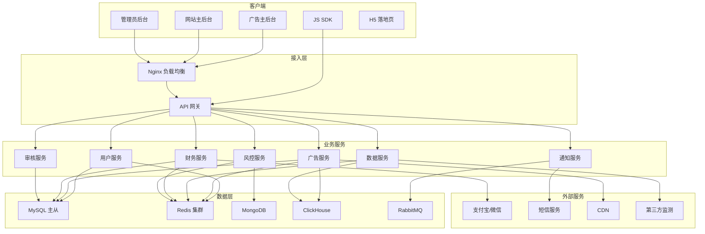
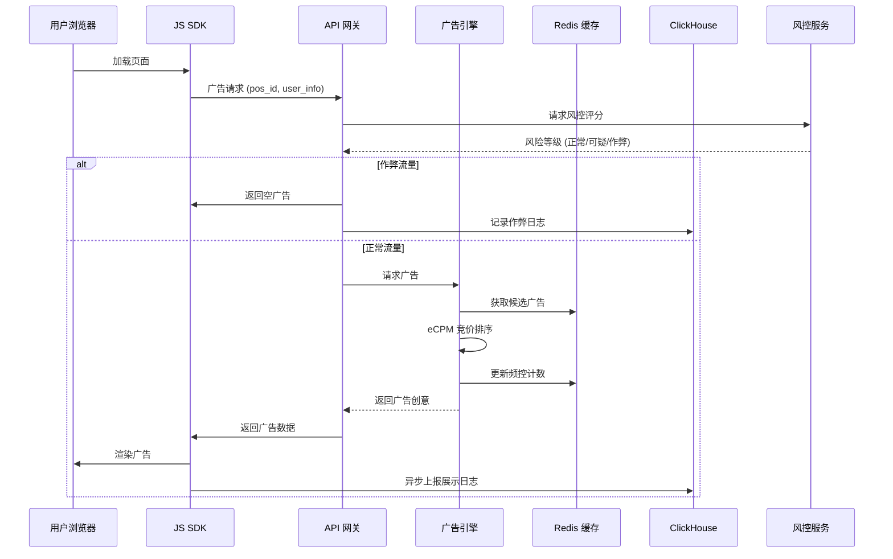
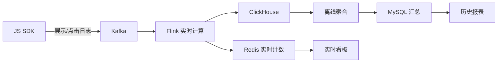

# 广告联盟系统 - 技术设计文档

**Feature Name:** ad-network  
**Updated:** 2026-06-27  
**Version:** 1.0

---

## 1. 概述

### 1.1 系统定位

广告联盟系统是连接广告主与网站主的商业化平台，提供广告投放、计费结算、数据统计、风险控制的全流程管理能力。

### 1.2 设计目标

| 目标 | 指标 |
|------|------|
| 高性能 | 广告请求响应 ≤ 100ms，支持 10 万 + QPS |
| 高可用 | 核心服务 99.99% 可用 |
| 高并发 | 支持万级并发用户，亿级日广告请求 |
| 可扩展 | 微服务架构，支持水平扩展 |
| 数据准确 | 财务数据 100% 准确，支持对账审计 |

### 1.3 技术栈选型

| 层次 | 技术选型 |
|------|----------|
| 前端 | Vue 3 + TypeScript + Element Plus + ECharts |
| 后端 | PHP 8.2（现有系统扩展）+ Go（高性能服务） |
| 数据库 | MySQL 8.0（主从）+ Redis（缓存）+ MongoDB（日志）+ ClickHouse（分析） |
| 消息队列 | RabbitMQ（异步任务）+ Kafka（数据流） |
| CDN | 阿里云 CDN/腾讯云 CDN |
| 容器化 | Docker + Kubernetes |
| 监控 | Prometheus + Grafana + ELK |

---

## 2. 系统架构

### 2.1 整体架构图



### 2.2 架构说明

#### 2.2.1 客户端层

| 客户端 | 技术 | 说明 |
|--------|------|------|
| 广告主后台 | Vue 3 SPA | 广告管理、数据查看、财务管理 |
| 网站主后台 | Vue 3 SPA | 网站管理、广告位管理、收益查看 |
| 管理员后台 | Vue 3 SPA | 审核管理、财务对账、系统配置 |
| JS SDK | 原生 JavaScript | 嵌入式广告请求与渲染，≤50KB |
| H5 落地页 | 响应式 HTML5 | 移动端落地页模板 |

#### 2.2.2 接入层

- **Nginx 负载均衡**：HTTPS 卸载、动静分离、限流
- **API 网关**：统一认证、路由转发、限流熔断、请求日志

#### 2.2.3 业务服务层

| 服务 | 职责 | 技术 |
|------|------|------|
| 用户服务 | 用户管理、认证鉴权、RBAC | PHP + Redis |
| 广告服务 | 广告 CRUD、检索、竞价、投放 | Go + Redis |
| 数据服务 | 数据采集、聚合、报表 | Go + ClickHouse |
| 财务服务 | 账户、充值、扣费、结算、提现 | PHP + MySQL |
| 审核服务 | 广告/网站审核、内容检测 | PHP + 第三方 AI |
| 风控服务 | 反作弊、黑名单、规则引擎 | Go + Redis + MongoDB |
| 通知服务 | 短信、邮件、站内信 | PHP + RabbitMQ |

#### 2.2.4 数据层

| 存储 | 用途 | 数据量级 |
|------|------|----------|
| MySQL | 业务数据（用户/广告/财务） | 千万级 |
| Redis | 缓存、会话、频控、实时计数 | 亿级 Key |
| MongoDB | 风控日志、操作日志 | 十亿级 |
| ClickHouse | 广告日志分析（展示/点击） | 百亿级 |

#### 2.2.5 外部服务

- **支付**：支付宝、微信支付、银联
- **短信**：阿里云短信、腾讯云短信
- **CDN**：图片/视频/JS 静态资源加速
- **第三方监测**：秒针、国双、AdMaster 数据对接

---

## 3. 核心模块设计

### 3.1 广告投放引擎



### 3.2 竞价排序算法

```
eCPM 计算公式：

1. CPM 广告
   eCPM = 出价

2. CPC 广告
   eCPM = CPC 出价 × eCTR × 1000
   eCTR = 预估点击率 (基于历史数据机器学习)

3. CPA 广告
   eCPM = CPA 出价 × eCTR × eCVR × 1000
   eCVR = 预估转化率

4. CPT 广告
   eCPM = 固定价格 (独占广告位)

排序：按 eCPM 降序排列，取 Top 1
```

### 3.3 数据流转



---

## 4. 数据模型设计

### 4.1 核心表结构

#### 4.1.1 用户体系

```sql
-- 用户基础表
CREATE TABLE users (
    id BIGINT PRIMARY KEY AUTO_INCREMENT,
    phone VARCHAR(20) NOT NULL UNIQUE,
    password_hash VARCHAR(255) NOT NULL,
    email VARCHAR(100),
    role ENUM('admin', 'auditor', 'advertiser', 'publisher') NOT NULL,
    status TINYINT DEFAULT 1, -- 1 正常 0 禁用
    company_name VARCHAR(200), -- 企业名称
    company_license VARCHAR(100), -- 营业执照号
    created_at DATETIME DEFAULT CURRENT_TIMESTAMP,
    updated_at DATETIME DEFAULT CURRENT_TIMESTAMP ON UPDATE CURRENT_TIMESTAMP,
    INDEX idx_phone (phone),
    INDEX idx_role (role)
) ENGINE=InnoDB DEFAULT CHARSET=utf8mb4;

-- 广告主信息
CREATE TABLE advertisers (
    id BIGINT PRIMARY KEY,
    user_id BIGINT NOT NULL,
    account_balance DECIMAL(20,2) DEFAULT 0, -- 账户余额
    frozen_balance DECIMAL(20,2) DEFAULT 0, -- 冻结金额
    total_recharge DECIMAL(20,2) DEFAULT 0, -- 累计充值
    total_spend DECIMAL(20,2) DEFAULT 0, -- 累计消耗
    industry VARCHAR(50), -- 所属行业
    contact_name VARCHAR(50),
    contact_phone VARCHAR(20),
    created_at DATETIME DEFAULT CURRENT_TIMESTAMP,
    FOREIGN KEY (user_id) REFERENCES users(id),
    INDEX idx_balance (account_balance)
) ENGINE=InnoDB DEFAULT CHARSET=utf8mb4;

-- 网站主信息
CREATE TABLE publishers (
    id BIGINT PRIMARY KEY,
    user_id BIGINT NOT NULL,
    account_balance DECIMAL(20,2) DEFAULT 0, -- 账户余额
    total_earning DECIMAL(20,2) DEFAULT 0, -- 累计收益
    total_withdraw DECIMAL(20,2) DEFAULT 0, -- 累计提现
    min_withdraw DECIMAL(10,2) DEFAULT 100, -- 最低提现门槛
    withdraw_account VARCHAR(100), -- 提现账号
    withdraw_type ENUM('alipay', 'wechat', 'bank') DEFAULT 'alipay',
    tax_rate DECIMAL(5,4) DEFAULT 0.01, -- 税率
    created_at DATETIME DEFAULT CURRENT_TIMESTAMP,
    FOREIGN KEY (user_id) REFERENCES users(id)
) ENGINE=InnoDB DEFAULT CHARSET=utf8mb4;
```

#### 4.1.2 广告系统

```sql
-- 广告活动
CREATE TABLE ad_campaigns (
    id BIGINT PRIMARY KEY AUTO_INCREMENT,
    advertiser_id BIGINT NOT NULL,
    name VARCHAR(100) NOT NULL,
    objective ENUM('brand', 'traffic', 'conversion') DEFAULT 'traffic',
    budget_total DECIMAL(20,2) NOT NULL, -- 总预算
    budget_daily DECIMAL(20,2) NOT NULL, -- 日预算
    budget_used DECIMAL(20,2) DEFAULT 0, -- 已用预算
    charge_type ENUM('CPM', 'CPC', 'CPA', 'CPT') NOT NULL,
    bid_price DECIMAL(10,4) NOT NULL, -- 出价
    start_date DATE NOT NULL,
    end_date DATE NOT NULL,
    status TINYINT DEFAULT 0, -- 0 草稿 1 待审核 2 审核通过 3 审核驳回 4 投放中 5 已暂停 6 已结束
    audit_remark VARCHAR(200), -- 审核意见
    created_at DATETIME DEFAULT CURRENT_TIMESTAMP,
    updated_at DATETIME DEFAULT CURRENT_TIMESTAMP ON UPDATE CURRENT_TIMESTAMP,
    FOREIGN KEY (advertiser_id) REFERENCES advertisers(id),
    INDEX idx_advertiser (advertiser_id),
    INDEX idx_status (status)
) ENGINE=InnoDB DEFAULT CHARSET=utf8mb4;

-- 广告组
CREATE TABLE ad_groups (
    id BIGINT PRIMARY KEY AUTO_INCREMENT,
    campaign_id BIGINT NOT NULL,
    name VARCHAR(100) NOT NULL,
    -- 定向条件
    gender TINYINT, -- 0 不限 1 男 2 女
    age_range VARCHAR(20), -- '18-24'
    regions TEXT, -- JSON 格式省市区
    schedule TEXT, -- JSON 格式投放时段
    devices TEXT, -- JSON 格式设备定向
    os_list TEXT, -- JSON 格式 OS 定向
    browser_list TEXT, -- JSON 格式浏览器定向
    media_whitelist TEXT, -- JSON 格式媒体白名单
    audience_packages TEXT, -- JSON 格式人群包
    -- 排除定向
    age_exclude TEXT,
    region_exclude TEXT,
    -- 频控
    frequency_cap INT DEFAULT 0, -- 单用户每日最多展示次数
    status TINYINT DEFAULT 1, -- 1 启用 0 禁用
    created_at DATETIME DEFAULT CURRENT_TIMESTAMP,
    FOREIGN KEY (campaign_id) REFERENCES ad_campaigns(id),
    INDEX idx_campaign (campaign_id)
) ENGINE=InnoDB DEFAULT CHARSET=utf8mb4;

-- 广告创意
CREATE TABLE ad_creatives (
    id BIGINT PRIMARY KEY AUTO_INCREMENT,
    ad_group_id BIGINT NOT NULL,
    type ENUM('image', 'video', 'native', 'popup', 'floating', 'code') NOT NULL,
    title VARCHAR(30),
    subtitle VARCHAR(60),
    description VARCHAR(200),
    landing_url VARCHAR(500), -- 落地页链接
    -- 图片素材
    image_url VARCHAR(255),
    image_width INT,
    image_height INT,
    image_md5 VARCHAR(32),
    -- 视频素材
    video_url VARCHAR(255),
    video_duration INT, -- 秒
    -- 代码广告
    ad_code TEXT,
    -- 状态
    status TINYINT DEFAULT 0, -- 0 草稿 1 待审核 2 审核通过 3 审核驳回
    audit_remark VARCHAR(200),
    created_at DATETIME DEFAULT CURRENT_TIMESTAMP,
    FOREIGN KEY (ad_group_id) REFERENCES ad_groups(id),
    INDEX idx_ad_group (ad_group_id),
    INDEX idx_status (status)
) ENGINE=InnoDB DEFAULT CHARSET=utf8mb4;
```

#### 4.1.3 广告位系统

```sql
-- 网站信息
CREATE TABLE publisher_websites (
    id BIGINT PRIMARY KEY AUTO_INCREMENT,
    publisher_id BIGINT NOT NULL,
    name VARCHAR(100) NOT NULL,
    domain VARCHAR(100) NOT NULL UNIQUE,
    icp_number VARCHAR(50), -- ICP 备案号
    category_id INT, -- 网站分类
    screenshot_url VARCHAR(255), -- 网站首页截图
    alexa_rank INT,
    daily_uv INT, -- 日 UV
    daily_pv INT, -- 日 PV
    status TINYINT DEFAULT 0, -- 0 待审核 1 审核通过 2 审核驳回 3 禁用
    audit_remark VARCHAR(200),
    created_at DATETIME DEFAULT CURRENT_TIMESTAMP,
    FOREIGN KEY (publisher_id) REFERENCES publishers(id),
    INDEX idx_publisher (publisher_id),
    INDEX idx_domain (domain)
) ENGINE=InnoDB DEFAULT CHARSET=utf8mb4;

-- 广告位
CREATE TABLE ad_positions (
    id BIGINT PRIMARY KEY AUTO_INCREMENT,
    website_id BIGINT NOT NULL,
    name VARCHAR(100) NOT NULL,
    code VARCHAR(32) NOT NULL UNIQUE, -- 广告位唯一标识
    type ENUM('image', 'native', 'popup', 'floating', 'video', 'code') NOT NULL,
    width INT NOT NULL,
    height INT NOT NULL,
    min_cpm DECIMAL(10,4) DEFAULT 0, -- 最低 CPM 出价
    visibility ENUM('public', 'private') DEFAULT 'public',
    allowed_advertisers TEXT, -- JSON 格式，私有广告位允许的广告主列表
    -- 屏蔽规则
    advertiser_blacklist TEXT, -- JSON 格式广告主黑名单
    industry_blacklist TEXT, -- JSON 格式行业黑名单
    domain_blacklist TEXT, -- JSON 格式竞品域名黑名单
    keyword_blacklist TEXT, -- JSON 格式敏感词黑名单
    status TINYINT DEFAULT 1, -- 1 启用 0 暂停
    created_at DATETIME DEFAULT CURRENT_TIMESTAMP,
    FOREIGN KEY (website_id) REFERENCES publisher_websites(id),
    INDEX idx_website (website_id),
    INDEX idx_code (code)
) ENGINE=InnoDB DEFAULT CHARSET=utf8mb4;
```

#### 4.1.4 财务系统

```sql
-- 账户表
CREATE TABLE accounts (
    id BIGINT PRIMARY KEY AUTO_INCREMENT,
    user_id BIGINT NOT NULL UNIQUE,
    account_type ENUM('advertiser', 'publisher') NOT NULL,
    balance DECIMAL(20,2) DEFAULT 0, -- 可用余额
    frozen_balance DECIMAL(20,2) DEFAULT 0, -- 冻结金额
    coupon_balance DECIMAL(20,2) DEFAULT 0, -- 优惠券余额
    created_at DATETIME DEFAULT CURRENT_TIMESTAMP,
    updated_at DATETIME DEFAULT CURRENT_TIMESTAMP ON UPDATE CURRENT_TIMESTAMP,
    FOREIGN KEY (user_id) REFERENCES users(id)
) ENGINE=InnoDB DEFAULT CHARSET=utf8mb4;

-- 交易流水
CREATE TABLE transactions (
    id BIGINT PRIMARY KEY AUTO_INCREMENT,
    account_id BIGINT NOT NULL,
    type ENUM('recharge', 'spend', 'earning', 'withdraw', 'refund', 'adjust') NOT NULL,
    amount DECIMAL(20,2) NOT NULL, -- 正数收入，负数支出
    balance_before DECIMAL(20,2) NOT NULL, -- 变更前余额
    balance_after DECIMAL(20,2) NOT NULL, -- 变更后余额
    related_id BIGINT, -- 关联订单/广告活动 ID
    description VARCHAR(200),
    created_at DATETIME DEFAULT CURRENT_TIMESTAMP,
    FOREIGN KEY (account_id) REFERENCES accounts(id),
    INDEX idx_account (account_id),
    INDEX idx_type (type),
    INDEX idx_created (created_at)
) ENGINE=InnoDB DEFAULT CHARSET=utf8mb4;

-- 充值订单
CREATE TABLE recharge_orders (
    id BIGINT PRIMARY KEY AUTO_INCREMENT,
    advertiser_id BIGINT NOT NULL,
    order_no VARCHAR(32) NOT NULL UNIQUE,
    amount DECIMAL(20,2) NOT NULL,
    bonus_amount DECIMAL(20,2) DEFAULT 0, -- 赠送金额
    channel ENUM('alipay', 'wechat', 'bank', 'offline') NOT NULL,
    status TINYINT DEFAULT 0, -- 0 待支付 1 已支付 2 已取消 3 支付失败
    payment_time DATETIME,
    created_at DATETIME DEFAULT CURRENT_TIMESTAMP,
    FOREIGN KEY (advertiser_id) REFERENCES advertisers(id),
    INDEX idx_order_no (order_no),
    INDEX idx_status (status)
) ENGINE=InnoDB DEFAULT CHARSET=utf8mb4;

-- 提现记录
CREATE TABLE withdrawals (
    id BIGINT PRIMARY KEY AUTO_INCREMENT,
    publisher_id BIGINT NOT NULL,
    order_no VARCHAR(32) NOT NULL UNIQUE,
    amount DECIMAL(20,2) NOT NULL,
    fee DECIMAL(20,2) NOT NULL, -- 手续费
    actual_amount DECIMAL(20,2) NOT NULL, -- 实际到账
    account_type ENUM('alipay', 'wechat', 'bank') NOT NULL,
    account_number VARCHAR(100) NOT NULL,
    account_name VARCHAR(100) NOT NULL,
    status TINYINT DEFAULT 0, -- 0 待审核 1 审核通过 2 审核驳回 3 打款中 4 已完成
    audit_remark VARCHAR(200),
    payment_time DATETIME,
    created_at DATETIME DEFAULT CURRENT_TIMESTAMP,
    FOREIGN KEY (publisher_id) REFERENCES publishers(id),
    INDEX idx_order_no (order_no),
    INDEX idx_status (status)
) ENGINE=InnoDB DEFAULT CHARSET=utf8mb4;
```

#### 4.1.5 数据日志（ClickHouse）

```sql
-- ClickHouse 展示日志表
CREATE TABLE ad_impressions (
    event_time DateTime64(3),
    request_id String,
    ad_position_id UInt64,
    website_id UInt64,
    publisher_id UInt64,
    campaign_id UInt64,
    ad_group_id UInt64,
    creative_id UInt64,
    advertiser_id UInt64,
    user_id String, -- Cookie/Device ID
    ip String,
    region String,
    country String,
    device String, -- PC/Mobile/Tablet
    os String,
    browser String,
    referer String,
    user_agent String,
    ecpm Decimal64(6),
    is_valid UInt8, -- 是否有效流量
    risk_score UInt8, -- 风险评分
    fraud_type String -- 作弊类型
) ENGINE = MergeTree()
PARTITION BY toYYYYMMDD(event_time)
ORDER BY (event_time, ad_position_id)
TTL event_time + INTERVAL 180 DAY;

-- ClickHouse 点击日志表
CREATE TABLE ad_clicks (
    event_time DateTime64(3),
    request_id String,
    impression_id String, -- 关联的展示 ID
    ad_position_id UInt64,
    website_id UInt64,
    campaign_id UInt64,
    ad_group_id UInt64,
    creative_id UInt64,
    advertiser_id UInt64,
    user_id String,
    ip String,
    region String,
    device String,
    os String,
    browser String,
    landing_url String,
    ecpm Decimal64(6),
    is_fraud UInt8,
    fraud_reason String
) ENGINE = MergeTree()
PARTITION BY toYYYYMMDD(event_time)
ORDER BY (event_time, creative_id)
TTL event_time + INTERVAL 180 DAY;
```

---

## 5. API 设计

### 5.1 广告请求 API

```
POST /api/v1/ad/request
Content-Type: application/json

Request:
{
    "position_code": "pos_123456",
    "website_id": 789,
    "page_url": "https://example.com/page",
    "user_info": {
        "user_id": "u_xxxxx",
        "ip": "1.2.3.4",
        "ua": "Mozilla/5.0...",
        "device": "mobile",
        "os": "iOS",
        "browser": "Safari",
        "region": "110100",
        "gender": "1",
        "age": "25-34"
    }
}

Response (success):
{
    "code": 0,
    "data": {
        "request_id": "req_xxxxxxxx",
        "creative_id": 456,
        "type": "image",
        "width": 300,
        "height": 250,
        "image_url": "https://cdn.example.com/ad/xxx.jpg",
        "click_url": "https://track.example.com/c/xxx",
        "impression_url": "https://track.example.com/i/xxx",
        "landing_url": "https://advertiser.com/landing",
        "title": "广告标题",
        "timeout": 3000,
        "backup_creatives": [...]
    }
}

Response (empty):
{
    "code": 0,
    "data": null
}

Response (fraud):
{
    "code": 1001,
    "message": "Invalid traffic"
}
```

### 5.2 数据上报 API

```
POST /api/v1/ad/impression
Content-Type: application/json

Request:
{
    "request_id": "req_xxxxxxxx",
    "creative_id": 456,
    "position_code": "pos_123456",
    "user_id": "u_xxxxx",
    "ip": "1.2.3.4",
    "timestamp": 1234567890123
}

POST /api/v1/ad/click
Content-Type: application/json

Request:
{
    "request_id": "req_xxxxxxxx",
    "creative_id": 456,
    "position_code": "pos_123456",
    "user_id": "u_xxxxx",
    "ip": "1.2.3.4",
    "landing_url": "https://...",
    "timestamp": 1234567890123
}
```

---

## 6. 错误处理

### 6.1 错误码定义

| 错误码 | 说明 |
|--------|------|
| 0 | 成功 |
| 1001 | 无效流量（作弊） |
| 1002 | 广告位不存在 |
| 1003 | 无可用广告 |
| 1004 | 广告请求参数错误 |
| 1005 | 广告位已暂停 |
| 2001 | 用户未登录 |
| 2002 | 权限不足 |
| 2003 | 账户余额不足 |
| 3001 | 广告审核未通过 |
| 3002 | 广告活动已暂停 |
| 4001 | 订单支付失败 |
| 4002 | 提现审核未通过 |
| 5001 | 系统内部错误 |

### 6.2 降级策略

1. **Redis 故障**：降级到 MySQL 查询，容忍响应时间增加
2. **ClickHouse 故障**：实时看板暂停，历史报表不受影响
3. **竞价服务故障**：返回默认广告或轮播广告
4. **CDN 故障**：回源到源站，使用备用 CDN

---

## 7. 测试策略

### 7.1 单元测试

- 核心算法测试（竞价排序、eCPM 计算）
- 服务层测试（广告检索、过滤逻辑）
- 工具函数测试（IP 解析、设备识别）

### 7.2 集成测试

- 广告请求完整流程
- 充值支付流程
- 提现结算流程
- 审核流程

### 7.3 性能测试

- 单接口压测（广告请求 API）
- 混合场景压测（模拟真实流量）
- 稳定性测试（7x24 小时运行）
- 并发用户测试（10000+ 并发）

### 7.4 数据准确性测试

- 计费准确性验证（对比手工计算）
- 展示/点击数据对账（SDK vs 服务端）
- 财务数据对账（系统 vs 支付渠道）

---

## 8. 部署架构

### 8.1 生产环境

```
┌─────────────────────────────────────────────┐
│              负载均衡层 (LVS + Nginx)        │
│           4 节点，支持自动扩缩容              │
└─────────────────────────────────────────────┘
                      │
┌─────────────────────────────────────────────┐
│              应用服务层 (K8s)               │
│  用户服务×2 │ 广告服务×8 │ 数据服务×4 │       │
│  财务服务×2 │ 审核服务×2 │ 风控服务×4 │       │
└─────────────────────────────────────────────┘
                      │
┌─────────────────────────────────────────────┐
│              数据层                          │
│  MySQL 主从 (1 主 3 从) + Redis 集群 (6 节点)   │
│  ClickHouse (3 节点 Shard+Replica)          │
│  MongoDB (3 节点副本集) + RabbitMQ 集群       │
└─────────────────────────────────────────────┘
```

### 8.2 资源配置

| 服务 | CPU | 内存 | 磁盘 | 节点数 |
|------|-----|------|------|--------|
| 广告引擎 | 8 核 | 16GB | 100GB | 8 |
| 数据服务 | 8 核 | 32GB | 500GB | 4 |
| 风控服务 | 4 核 | 16GB | 200GB | 4 |
| MySQL | 16 核 | 64GB | 2TB SSD | 4 |
| Redis | 8 核 | 32GB | - | 6 |
| ClickHouse | 16 核 | 64GB | 4TB SSD | 3 |

---

## 9. 监控与告警

### 9.1 监控指标

| 类型 | 指标 | 告警阈值 |
|------|------|----------|
| 系统 | CPU 使用率 | > 80% |
| 系统 | 内存使用率 | > 85% |
| 系统 | 磁盘使用率 | > 80% |
| 应用 | 接口响应时间 (P99) | > 500ms |
| 应用 | 接口错误率 | > 1% |
| 广告 | 空广告率 | > 20% |
| 广告 | 广告请求 QPS | 突增/突降 50% |
| 数据 | 日志延迟 | > 10 分钟 |
| 财务 | 充值失败率 | > 5% |

### 9.2 告警渠道

- 企业微信机器人（即时）
- 短信（P0 级别）
- 邮件（日报汇总）
- 电话（严重故障）

---

## 10. 安全设计

### 10.1 认证鉴权

- JWT Token 认证（有效期 2 小时，刷新 Token 7 天）
- RBAC 权限控制（菜单权限 + 操作权限 + 数据权限）
- API 签名验证（防止请求篡改）

### 10.2 数据安全

- HTTPS 加密传输
- 敏感数据加密存储（手机号、身份证、银行卡）
- 数据脱敏展示
- 操作日志审计

### 10.3 防攻击

- WAF 防护（SQL 注入、XSS、CC 攻击）
- API 限流（单 IP 每分钟请求次数限制）
- DDoS 防护（接入高防 IP）

---

## 11. 参考文献

[^1]: (Google Ads Architecture) - Google 广告系统架构设计
[^2]: (Facebook Ads Delivery) - Facebook 广告投放系统
[^3]: (ClickHouse Documentation) - ClickHouse 官方文档
[^4]: (RBAC Model) - NIST RBAC 标准
[^5]: (OpenRTB Protocol) - IAB OpenRTB 实时竞价协议
